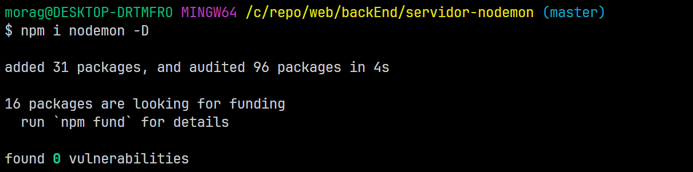
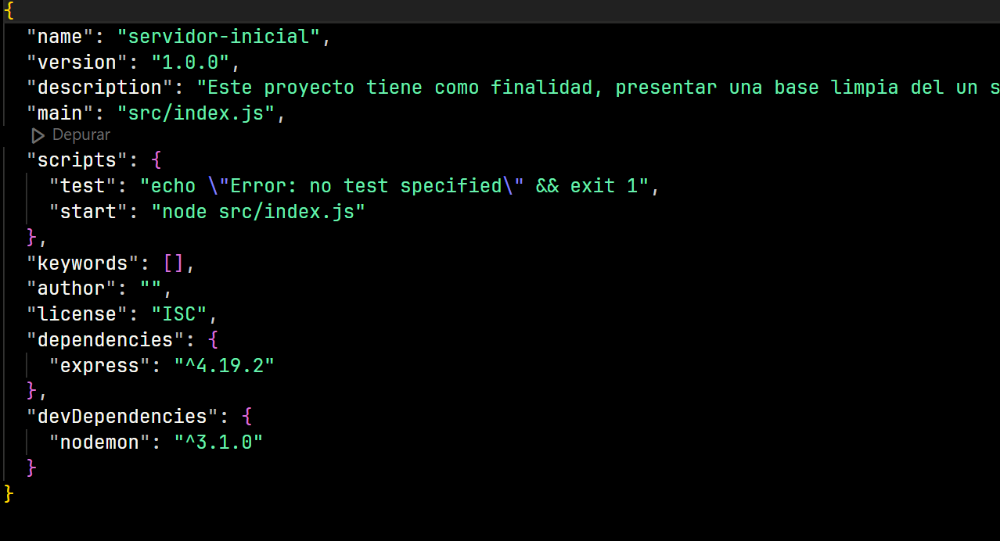
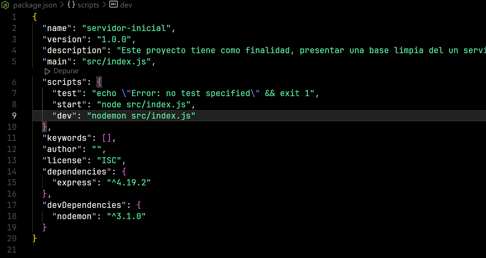
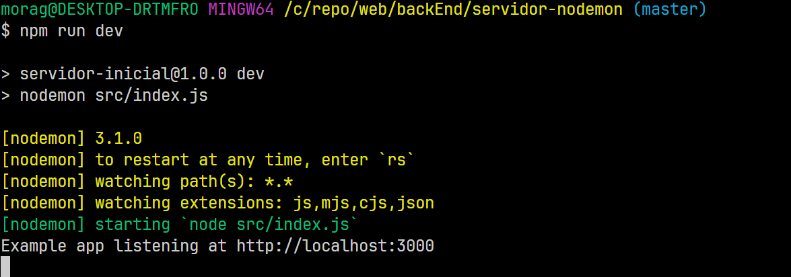
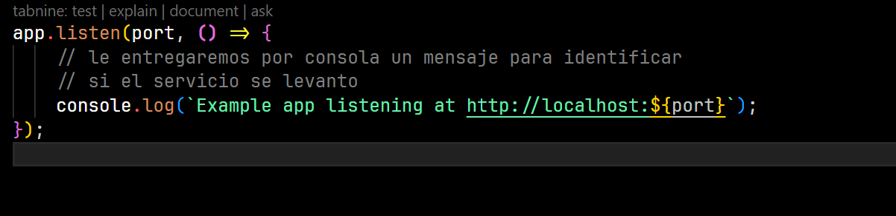
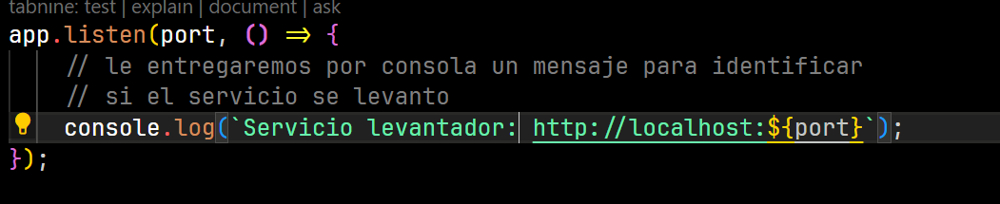
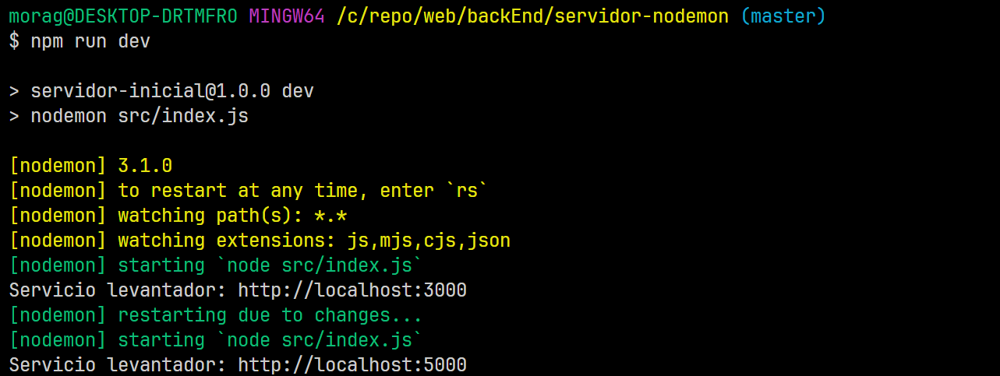

NODEMON

Nodemon es un modulo de npm el cual nos ayudara dentro del entorno de desarrollo
Primero la intalacion del modulo:

Instruccion -> npm i nodemon -D

<< El argumento -D >>
    Es para separar los modulos que solo utilizaremos en el entorno de desarrollos,
    puesto que el entorno de produccion debe ser lo mas limpio y simplificado posible para optimizar,
    memoria y utilidades del servidor.

Con esto podemon ver que en el package.json aparece un nuevo apartado de
dependencias el cual solo se utilizara en desarrollo, mas no en produccion.

Una vez instalado el modulo de nodemon debemos dirigirnos al apartado de escripts,
en donde introduciremos una nueva instruccion para levantar nuestro servidor con nodemon

-> "dev": "nodemon src/index.js"

con esto podremos levantar el servidor de node de tal manera que no tendremos que,
cerrar el sistema y volver a levantarlo, cada vez que generemos un cambio, nodemon
hace ese trabajo por nosotros automaticamente.

se levanta el servicio del servidor:

se modifica el mensaje de bienvenida del servidor:

por esto:

se modifica el puerto del servidor del 3000 a 5000 en el archivo index,
nodemon actualiza automaticamente el servidor, sin la necesidad de parar el servidor.

