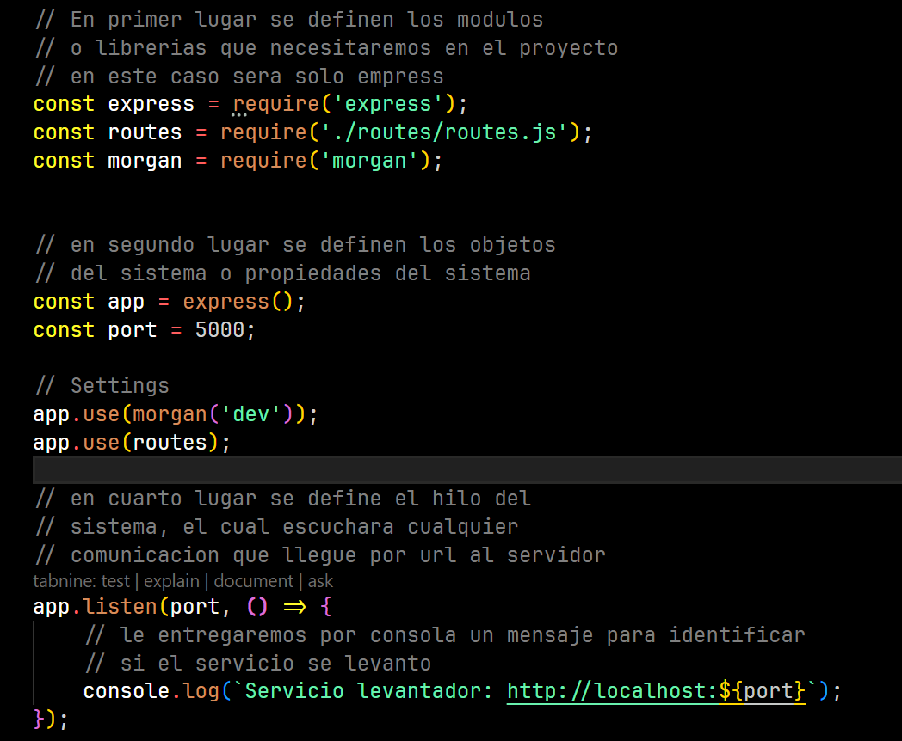

Morgan es un modulo de npm que nos servira para mostrar las entradas del servidor,
imprimiendo las peticiones http al servidor por la consola.

Se instala la dependencia de morgan con el argumento -D para el apartador de desarrollo
npm i morgan -D

Luego se defie la dependencia de morgan en el archivo del servidor

