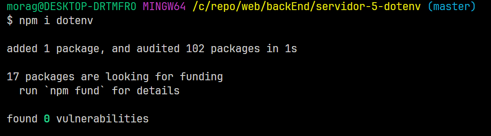
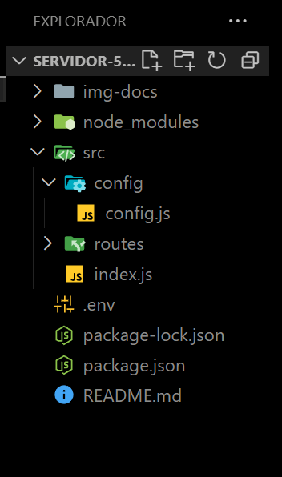
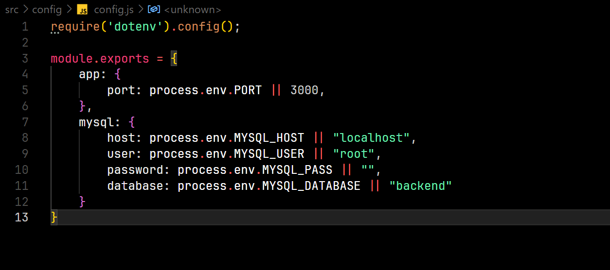

DotENV es un modulo de npm el cual nos servira para crear un archivo,
de configuracion que tendra informacion sensible de nuestra aplicacion.

el archivo .env no es un fichero que se pueda leer en cualquier lugar,
estos utilizan dotenv que no es algo que venga enbavido en los sistemas
de servidores.

es importante recalcar esto debido a las complicaciones que pueden ocurrir
en caso de no poder interpretar el archivo con extencion .env

para instalar dotenv en el proyecto utilizaremos la siguiente instruccion.

->npm i dotenv

en el explorador del proyecto debemos crear un archivo .env 
y una archivo de configuraciones, a mi preferencia queda mejor en un
directorio aparte para que dentro de este queden todos los archivos de configuracion
del sistema.

hasta este punto el explorador del proyecto deberia verse asi:

En este archivo de configuracion, se definen las referencias al otro archivo .env

