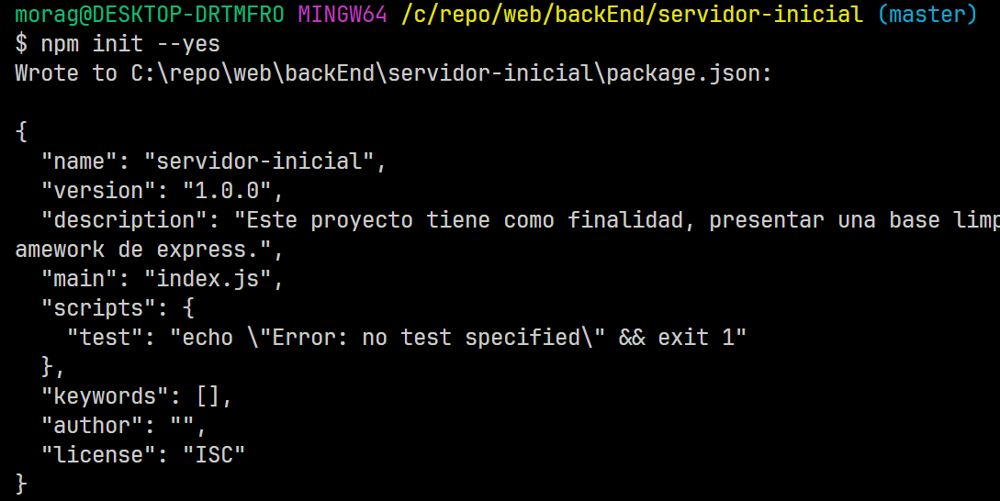
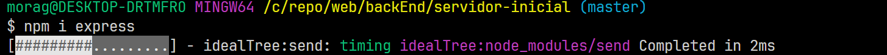
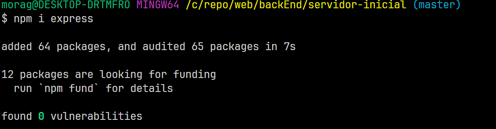

Este proyecto tiene como finalidad, presentar una base limpia del un servidor del
framework de express.

Este servidor contiene 2 rutas establecidas y declaradas con el modulo de Router de express.

En primer lugar para generar el package.json del proyecto utilizaremos la instuccion en consola:
-> npm init --yes

Para este ejemplo solo utilizaremos el paquete de express desde npm,
utilizando la instruccion:
-> npm install express

