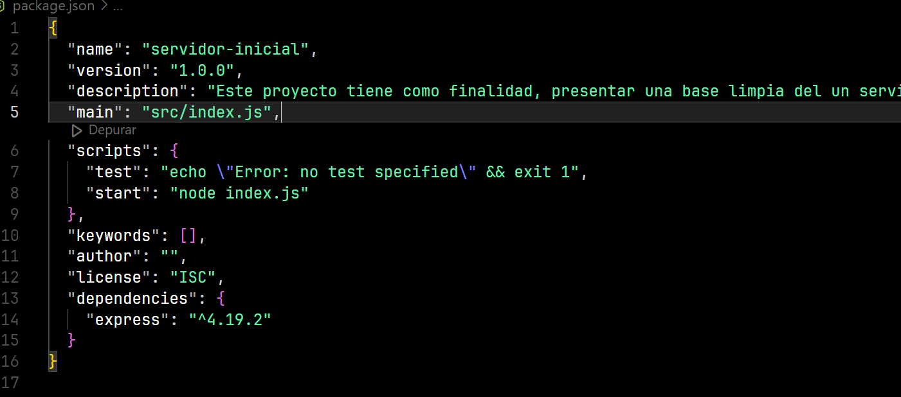

Este proyecto tiene como finalidad, presentar una base limpia del un servidor del
framework de express.

Este servidor contiene 2 rutas establecidas y declaradas con el modulo de Router de express.

En primer lugar para generar el package.json del proyecto utilizaremos la instuccion en consola:
-> npm init --yes

Para este ejemplo solo utilizaremos el paquete de express desde npm,
utilizando la instruccion:
-> npm install express

Agregar instruccion de arranque del servidor de node en el package.jason:
"scripts": {
    "test": "echo \"Error: no test specified\" && exit 1",
    "start": "node index.js"
},

Al agregar esta instruccion en los scripts del proyecto, nos permitira
iniciar un servidor escribiendo la siguiente instruccion, en la terminal
situedad en la raiz del proyecto:
-> npm run start

Probablemente si llegaste hasta este punto ocurrio un error:

Esto es por que el archivo index.js no esta creado, debes crearlo.
En el ide de visual studio code, en la ventana desplegable del proyecto,
crearemos una carpeta la cual contendra todo el desarrollo del proyecto,
a este directorio le llamaremos src y hasta este punto su proyecto deberia verse
asi:

Dentro de esta carpera crearemos nuestro archivo de arranque el entry-point,
el cual podemos declarar en el fichero de configuraciones de nuestra aplicacion.

